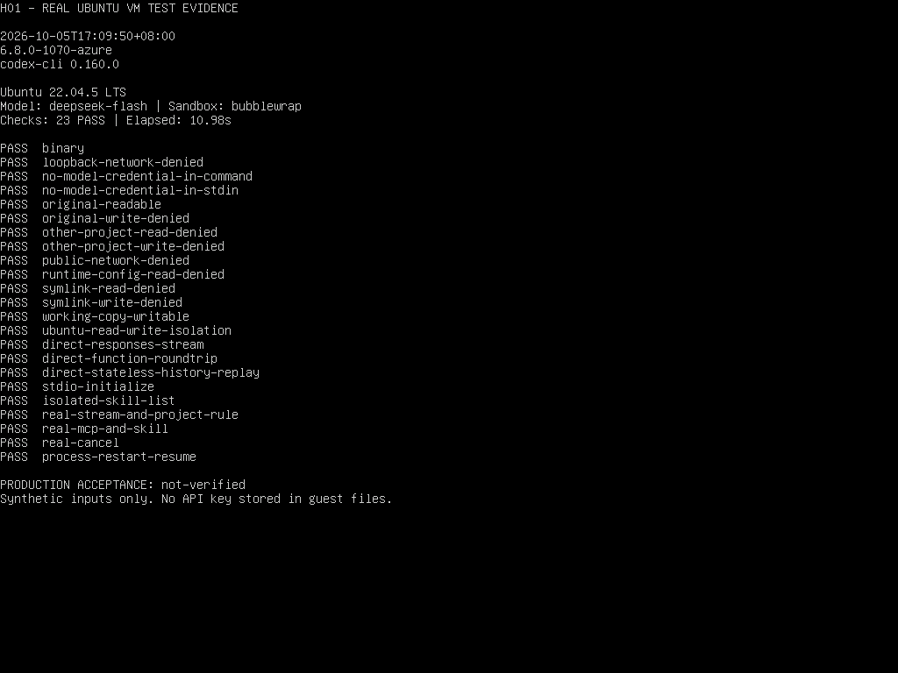

# 项目 AI 工作区 H01 技术验证

结论：固定 Codex 0.160.0＋真实 DeepSeek 在本机 Ubuntu 22.04.5 LTS 虚机完成 23 项检查，全部通过，最终完整运行 10.98 秒；Windows 开发验证也回归通过。本地 Linux 接入技术可行，候选源码仍须本次提交的 frontend/full 检查与审查后才能交接，不据此启用产品模块。企业正式服务器尚未登录核对内核与隔离策略，部署身份验收仍归 H04／H12。

总跟踪：[H00 #72](https://github.com/gnedhy/honghao-ai-workbench/issues/72)。技术验证：[H01 #73](https://github.com/gnedhy/honghao-ai-workbench/issues/73)。GitHub Issue 保存各阶段规格、依赖和状态；本页保存本次验证证据与复现入口。

## 基线与候选范围

- 源码：`3019c825feb27bfe73950ea57ee079dfb8037dc0`，独立 managed worktree；原工作区的其他未提交事项未带入。
- 集成分支：`codex/ai-project-workspace`；本项：`codex/h01-codex-feasibility`。任务 PR 汇入集成分支，H12 全部验收后才准备 main 的最终 PR；本项阻塞解除前不实施依赖其结果的产品改造。
- 独立内核：官方 `rust-v0.160.0` Windows x64，实际 `--version` 为 `codex-cli 0.160.0`。归档 SHA-256：`3927169c5f287cbb0fac256c43972e987b7383b5d661efd3d7727df18a95ec5a`；二进制 SHA-256：`fdda5fa3cf3fb3d000b876720742857676293e4315e4b045fae6f8bd7e866d1d`。不使用桌面客户端内置程序。
- [验证脚本](../../../scripts/check-codex-h01.py)现支持 Windows 开发验证和 Ubuntu 22.04 x64 非 root 测试；无密钥自检可跨平台运行，Python 3.10 及以上只使用标准库。Linux 回执明确标记本地虚机，不作为生产部署验收。独立临时配置、合成项目／规则／技能、单一合成只读 MCP；不连接平台数据库或附件，不修改正式启用状态。配置中不保存密钥；子工具不继承模型密钥；未预期的服务器请求直接拒绝。
- [模型元数据样本](../../../scripts/fixtures/codex-h01-models.json)来自 2026-10-05 DeepSeek 官方集成说明，只保留 `deepseek-flash`，说明文字改为合成验证用途。此文件不声明平台已支持图片、联网或多 Agent。

## 实测结果

最终完整本机验证：2026-10-05 12:15:46 北京时间，合计 10.515 秒。数值回执位于本机 `.scratch/h01/receipt-20261005-mxc-final.json`，不含密钥、提示词、回复、原始错误或业务内容。早期非提权、提权初始化和 MXC 启动失败分别保留为兼容发现；`.scratch` 中的诊断脚本不作为交付入口，不上传原始日志。

| 检查 | 实际证据 | 结论与边界 |
| --- | --- | --- |
| 官方程序完整性、版本、协议生成 | 哈希匹配；原生 `generate-json-schema` 成功 | 通过；生成结果用于本版本字段核对 |
| DeepSeek 真实流式 | 收到 10 个正文增量，合成标记匹配，完整结束 | 直连通过；模型网络 0.938 秒，不能称为页面或数据库性能 |
| 真实函数调用及结果回传 | 模型调用合成函数，回传固定数量 17 后模型使用该值 | 直连通过；不代表业务权限验收 |
| 历史重放 | 回传实际上一轮 output 后识别原标记 | 直连通过 |
| app-server | stdio 初始化成功，`experimentalApi=false` | 握手通过；未启用实验性字段 |
| 项目技能发现 | 合成项目技能可发现；测试配置禁用 28 项当前账号技能 | 发现／禁用通过；部署身份配置在 H04／H12 验证 |
| Windows readiness | 非提权与 MXC 均可返回 `ready` | 不能替代目标权限策略测试；MXC 另实测成功 |
| 旧后端受限读取会话启动 | 非提权拒绝会话；提权初始化拒绝缺少全盘读取的策略 | 失败时阻断通过；这两个后端未满足目标策略 |
| 原生真实回复及项目规则 | 18 个正文增量，实际合成规则标记出现 | MXC 通过 |
| 原生技能与 MCP | 显式技能实际生效；合成 lookup 完成且结果用于回答 | MXC 通过；不代表平台业务查询已接入 |
| 原生取消与进程重启恢复 | interrupted 结束；重新启动后同一 threadId 恢复原标记 | MXC 通过；不是新建会话替代 |
| Windows 文件正反例 | 原件可读不可写；副本可写；其他项目读写被拒绝；运行配置不可读 | MXC 通过，真实 Python 进程执行，宿主复核原件未变 |
| 目录链接越界 | 写区域内 Junction 指向另一个合成项目，读写均被拒绝 | MXC 通过；硬链接、其他路径编码及服务端导入仍需专项验证 |
| 禁网与凭据 | 宿主先确认两个端点可达，沙箱本地及公网连接均失败；命令无模型密钥 | MXC 通过；未测试代理开放模式或任意联网 |
| 企业服务器 | 用户确认 Ubuntu 22.04.5 LTS；架构、实际内核、隔离策略尚未核对 | Linux 运行与隔离待验证；部署服务身份另归 H04／H12 |

Windows 脚本回执记录 `localFeasibility=passed` 和 `validationScope=windows-development-only`；其 Ubuntu 检查保持未验证并返回 `blocked`，这是开发证据的范围限制。下面的 Linux 独立回执记录本地 Ubuntu 虚机通过，不混用两种范围。此入口不会自动关闭 H01，也不会启用产品模块。服务账号、硬链接与导入防护、正式升级回退等仍须对应阶段实测。早期回执曾把服务账号列为本项待验证，现已纠正阶段归属；保留历史回执，不据此新增 H01 阻塞条件。

## Ubuntu 本地虚机实测

用户已授权在 E 盘搭建完整虚机；Hyper-V 重启后已完成 Ubuntu 初始化及正常启动。2026-10-05 17:07:35 北京时间开始最终验证，23 项全部通过，合计 10.98 秒。验证使用本机独立合成目录，未操作正式服务器、平台数据库或业务附件。

| 项目 | 实际证据 |
| --- | --- |
| 环境 | Ubuntu 22.04.5 LTS，x86_64，内核 6.8.0-1070-azure，Hyper-V 第二代，4 核／6GB／60GB 动态磁盘 |
| 身份与位置 | UID 1000 h01tester；虚机配置及磁盘位于 E 盘，未挂载 Windows 工作目录 |
| 固定程序 | 官方完整包 SHA-256 `4fcc47ab57f52ff75363951a8761146cd10c8288bd86fed45487dbb204a16b71`；bin/codex SHA-256 `12eb3e81114588aca3b7998f4f19e8997b056aca08e57a7ca7c8a3ec8c652aad` |
| 隔离后端 | 明确启用 bubblewrap、禁用旧 Landlock；随包 bwrap SHA-256 `01fb705f067bd5365b63d8ad2323a61c8d007733ca5e649437e086f3fb9935d8` |
| 文件正反例 | 原件可读不可写，工作副本可写，其他项目与运行配置读写边界有效；符号链接越界读写均拒绝，宿主复核原件未变 |
| 网络正反例 | 沙箱外先确认回环与公网端点可达，再确认沙箱内两种连接均失败；不依赖 DNS 失败作为禁网证据 |
| 凭据 | 密钥经 SSH 标准输入进入控制器内存，不保存到虚机文件；版本及沙箱子进程 stdin 为 DEVNULL、命令环境无密钥，真实 MCP 子进程检查无模型密钥 |
| 真实 DeepSeek | Responses 流式 10 个正文增量，模型网络 0.944 秒；真实函数调用消费数量 17，历史重放成功 |
| app-server | 稳定 stdio 初始化、项目规则生效；真实回复 26 个正文增量 |
| 技能与 MCP | 合成项目技能发现并显式调用成功，合成只读 lookup 实际完成；独立 Linux 身份未发现外部技能 |
| 取消与恢复 | interrupt 后状态为 interrupted；控制器进程重启后以原 threadId 恢复并识别原标记 |
| 脚本兼容回归 | Windows 与 Ubuntu 无密钥自检通过；修改后的 Windows MXC 真实验证通过，合计 13.844 秒，回执仍保留 Windows 范围限制 |

脱敏完整回执在本机 `E:/VMs/Ubuntu-22.04-AI-Test/logs/receipt-linux-real-final-02.json`；没有密钥、提示词、回复或原始错误。Ubuntu 控制台于 17:09:50 展示该实际回执，截图如下。



本轮发现：虚机 GitHub 下载出现 TLS EOF，改由 Windows 获取官方包，校验后传入虚机；没有关闭证书验证。独立 Linux 程序安装在用户目录，沙箱需明确允许固定 bin 目录只读，未放开 root。Linux 只读挂载返回 EROFS，隐藏越界目录可能返回 ENOENT，验证只接受明确的拒绝错误并复核合成原件。早期失败分别留证，最终回执不覆盖失败记录。

Ubuntu 镜像是官方 Azure VHD，已修正仅 Azure 数据源造成的初始化等待，使用 NoCloud 并禁用 Azure 代理；仍使用 Azure 内核，不能当作与生产内核完全相同。H04／H12 仍须核对生产运行身份、实际内核、依赖、网络和服务重启；平台权限、硬链接／导入防护、完整业务回归、性能负载及升级回退由相应 Issue 验收。当前模型调用与总探针耗时不是浏览器、数据库或生产性能结论。app-server 的实验性上线限制继续保留。

## 实际兼容问题

1. 本版本 schema 仍列出 `approval_policy="untrusted"`，实际程序拒绝启动。验证改为 `on-request`，测试客户端拒绝任何意外审批请求；不授予全盘或自动审批。
2. DeepSeek thinking 模式下强制选择指定函数实际返回 HTTP 400。改为原生兼容的 `tool_choice="auto"`，并断言模型真的调用函数及消费结果。首次失败保留为兼容发现，不解释为完整通过。
3. 在 Windows 实测，只换 `CODEX_HOME`、`HOME`／`USERPROFILE` 或设置 `skip_host_skill_discovery` 不能阻止本机账号的技能被发现。验证关闭自动技能说明并在独立配置中禁用外部技能；企业候选仍须受控服务身份与技能来源，Linux 下另测，不能把禁用列表当作文件隔离。
4. `unelevated` 的 readiness 为 ready，但受限读取会话仍拒绝启动；提权 setup 同样要求有效的 `:root` 读取。实测没有为运行扩大读取根目录，也未创建系统账号／组或修改防火墙。
5. 本版本稳定 `skills/list` 只有 `cwds`／`forceReload`，没有最新文档中的额外技能根字段；稳定 thread/start 未包含 dynamicTools。后续接口设计必须按候选程序的实际协议验证，业务工具可评估已有 MCP 路径，不能先写不存在的接口。
6. 本版本原生 MXC 支持受限读取且不需要旧后端的管理员初始化。明确配置 `windows.sandbox="mxc"`，不使用自动回退；失败仍阻断。系统 build 和 readiness 只能作记录，PSEC 能力及实际策略必须测试。
7. 最小化子进程环境遗漏 Windows 运行变量时，MXC 启动失败；shell inherit=none 又会丢失这些变量。验证入口只透传明确 Windows 系统变量，并提供自己的合成用户目录；命令环境不传模型密钥或其他业务变量。修正后实际原生会话与命令均通过。

## 复现与环境准备

先在源码候选执行无密钥检查：

```powershell
python scripts/check-codex-h01.py --self-test
```

用户已表示本机可由管理员协助。实际提权初始化在目标读取策略验证阶段即失败，尚未进行系统变更；管理员初始化不能绕过后端策略限制。本机 MXC 不依赖该初始化，因此删除了未能满足目标的安装入口，保留失败回执和源代码依据。

Ubuntu 验证环境：目前正式服务器未提供隔离测试连接；本轮已按用户授权在 E 盘建立独立 Hyper-V 虚机并实测，不在正式服务执行测试或安装依赖。没有安装 WSL。发行版版本号不能推定生产内核和宿主策略。以下环境核对也适用于后续部署前准备。

执行顺序与边界：

1. 在获准环境只读核对系统版本、架构、内核、当前 UID、是否容器及用户命名空间限制。下列命令已在本机虚机执行，正式服务器仍未核对：

   ```sh
   cat /etc/os-release
   uname -m
   uname -r
   id -u
   systemd-detect-virt
   command -v bwrap
   ```

2. 明确测试身份与目录，不继承正式服务配置、数据库、附件或密钥，不操作现有服务。若只有正式宿主，先确认能否提供独立测试虚机或等效隔离环境；未经确认不直接在该宿主安装依赖或运行验证。
3. 按实际架构核对固定版本 Linux 包及辅助程序、适配现有验证入口。先做无密钥自检、协议握手与合成文件／网络正反例；失败即停，不扩大权限或关闭隔离。
4. 前述通过后，使用另行配置的测试密钥执行真实 DeepSeek、规则、技能、只读 MCP、取消和进程重启恢复；密钥由获准调用方经受保护 stdin 注入控制器内存，不复制密钥文件到虚机、正式服务器或 CI。
5. 每次新建脱敏回执，记录实际系统／内核／架构、程序摘要、合成检查、结果与未覆盖项。清理仅限本次所属的临时合成目录，保留审阅证据；候选未验收不解除依赖，正式服务身份与产品回归另在 H04／H12 验收。

固定版本 Linux 源码使用 bubblewrap 隔离文件系统，结合命名空间与 seccomp；受限读取策略不能以旧 Landlock 后端替代。H01 应先适配既有验证入口，再在 Ubuntu 测试身份及合成目录实测：原件只读、副本可写、其他项目与运行配置不可读、符号链接越界拒绝、本地及公网禁网、子工具无模型凭据，并验证同版本 app-server 的真实模型、规则、技能、MCP、取消和重启恢复。失败时保留检查结果并阻断；不授予 root、不放开跨项目读取、不自动回退。普通 Linux CI 可提供其自身环境的证据，不能代替企业目标环境或真实 API 验收。

首个候选继续固定 0.160.0；Linux 官方包与辅助程序按目标架构另核对，不能沿用 Windows 哈希。已读取官方发布的 Linux x64 musl 完整包摘要：`codex-package-x86_64-unknown-linux-musl.tar.gz`，SHA-256 `4fcc47ab57f52ff75363951a8761146cd10c8288bd86fed45487dbb204a16b71`。本轮已在两端校验完整包并在本机 x64 虚机实际运行；ARM 主机不得使用该包。

服务账号指 Linux 后台服务的操作系统运行身份，与平台员工登录和项目所有权分开。H04 设计其必要文件／进程权限、独立配置、受保护密钥来源与服务启动方式，H12 以实际部署身份验证启动、退出、重启和隔离。可复用符合要求的现有服务身份，不要求每位员工或每个项目建立 Linux 账号，不要求用户在聊天中提供账号密码；Windows 管理员协助只与开发机历史验证有关。

Ubuntu 无密钥检查与真实测试入口（真实调用的 stdin 由受保护启动方提供，不把密钥拼入命令）：

```sh
python3 scripts/check-codex-h01.py --self-test
python3 scripts/check-codex-h01.py --codex '<固定版本 bin/codex>' --catalog scripts/fixtures/codex-h01-models.json --sandbox-only --output '<新隔离回执.json>'
python3 scripts/check-codex-h01.py --codex '<固定版本 bin/codex>' --catalog scripts/fixtures/codex-h01-models.json --key-stdin --output '<新真实回执.json>'
```

Windows 开发证据的复现命令（不是 Ubuntu 部署命令；密钥文件在仓库外，输出使用新名称以保留失败结果）：

```powershell
python scripts/check-codex-h01.py `
  --codex '<固定版本 codex.exe 绝对路径>' `
  --catalog scripts/fixtures/codex-h01-models.json `
  --key-file '<仓库外测试密钥文件绝对路径>' `
  --windows-sandbox mxc `
  --output .scratch/h01/receipt-new.json
```

不得把现有生产数据、附件或身份作为测试资料。当前验证入口创建两处合成项目、只读原件、可写副本和目录链接，使用无网命令；Python 安装目录仅作受控读取依赖。账号／密钥权限及平台两员工权限在相应阶段另核对。本次 Ubuntu 基线修正只涉及项目 AI 候选，不改写现有本机 Windows 发布历史，也不改变生产部署或模块状态。

## 交付和恢复

本项目前只增加验证入口、无凭据模型样本和验证记录，没有平台业务接口、数据库迁移、模块启用、部署或 main 合并。功能分支恢复仅撤回这些候选文件，不覆盖业务数据。H02–H13 及 F01–F03 共 16 项已创建为 #72 的原生子 Issue，依赖已按批准计划登记；未设计完的项继续保持非可开发状态。

源码提交／PR 与远端 CI 的最终状态以该任务 PR 为准。本轮脚本自检及真实 API 通过不替代完整平台回归，也不替代 H01 完整验收。正式启用继续执行 [既有门禁](../../agents/continuous-quality.md)、[工作台接入](../../agents/workbench-integration.md)与[运行及启用规范](../../运行与维护.md)。

现有 full CI 增加无凭据 `--self-test`，覆盖密钥格式／编码、拒绝意外审批、关闭连接和环境变量隔离；不调用 DeepSeek、不下载 Windows 程序、不上传本机回执。现有 frontend/full、样本、门禁、预算及工件白名单不变；CI 不能作为 Windows 或真实模型验收证据。

## 一级来源

- [Codex 0.160.0 官方发布](https://github.com/openai/codex/releases/tag/rust-v0.160.0)：程序及版本基线。
- [本版本配置 schema](https://github.com/openai/codex/blob/rust-v0.160.0/codex-rs/core/config.schema.json)和实际生成的协议：字段基线；实际拒绝情况以上述运行证据为准。
- [DeepSeek Codex 集成说明](https://api-docs.deepseek.com/quick_start/agent_integrations/codex/)与[Responses 兼容说明](https://api-docs.deepseek.com/guides/responses_api/)：模型元数据、直连与无状态历史；强制函数兼容按实测记录。
- [Windows 原生沙箱](https://learn.chatgpt.com/docs/windows/windows-sandbox)与[权限配置](https://learn.chatgpt.com/docs/permissions)：管理员初始化及权限策略。官方较新文档中的回退建议不改变本计划的跨项目读取隔离要求。
- [固定版本 Windows 策略校验](https://github.com/openai/codex/blob/rust-v0.160.0/codex-rs/windows-sandbox-rs/src/resolved_permissions.rs)及[MXC 后端说明](https://github.com/openai/codex/blob/rust-v0.160.0/codex-rs/mxc-sandbox/README.md)：旧后端的 root 读取要求、新后端的实际能力检查、严格选择及无回退；部署判断仍以实测为准。
- [固定版本 Linux 沙箱说明](https://github.com/openai/codex/blob/rust-v0.160.0/codex-rs/linux-sandbox/README.md)：bubblewrap、用户／进程／网络命名空间、seccomp 及受限读取策略；Ubuntu 目标环境仍需实测。
- [app-server 说明](https://learn.chatgpt.com/docs/app-server)：实验性、尚不承诺生产工作负载；该限制继续留在正式上线判断中。
