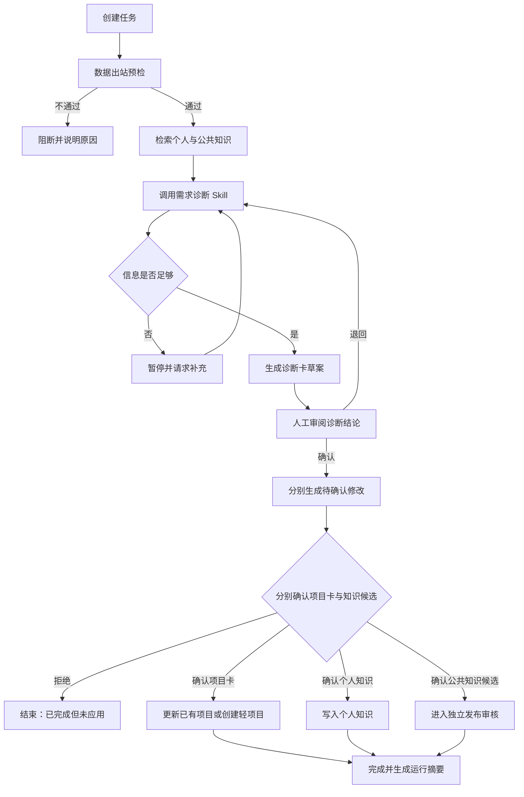

> 历史资料：仅供追溯，现役约定见 README、CONTEXT 和 DESIGN。

# 首条 Workflow 与验收样本

## 1. Workflow 名称

**AI 需求诊断与项目建卡 V0.1**

目标：把一句话需求、表单、访谈记录或会议纪要，整理为可判断、可拆解、可验证的 AI 需求诊断卡；经人工审阅后，分别确认项目卡、个人知识候选和公共知识候选。

## 2. 输入

- 需求材料：文本或受控工作目录内的 Markdown/TXT 文件。
- 发起人补充信息：部门、角色、问题、当前流程、期望结果。
- 可选知识上下文：个人知识与已发布公共知识。
- 明确约束：数据敏感度、允许使用的模型、允许写入的目标。

## 3. 固定流程

### Harness 与 Loop 边界

- Workflow 是外层固定流程，负责节点顺序、人工关口和正式写入边界。
- 智能体执行器（Harness）在“知识检索—需求诊断—结果检查”等执行节点内提供统一运行上下文、Provider、技能、工具白名单、预算、事件和检查点。
- 执行循环（Loop）按“理解 → 计划 → 执行 → 观察 → 判断”迭代，但必须受到最大步骤、时间和用量预算约束。
- 每轮必须记录阶段、调用对象、结果摘要和剩余预算；不保存模型隐式推理。
- Loop 只能继续、完成、等待用户、等待确认、被策略阻断、预算耗尽、失败或取消，不能无限运行。
- Harness 与 Loop 均不得直接越过待确认修改写入项目卡或知识。

## 4. 需求诊断卡最小字段

1. 原始需求与来源。
2. 事实、初步 AI 判断、缺失信息分别列示。
3. 当前流程与痛点。
4. 目标用户和业务负责人。
5. 建议分流：规则自动化 / 场景 Skill / Workflow / 暂不适合 AI。
6. 数据输入、输出、敏感度和出站限制。
7. 人工关口与不可自动决策事项。
8. 验证样本、成功标准、风险和下一步。
9. 引用的知识条目与 Skill 版本。

## 5. 暂停、拒绝与恢复规则

- 信息不足：进入 `waiting`，原因为 `waiting_input`，明确列出最多 5 个关键问题。
- 诊断卡待审阅：进入 `waiting`，原因为 `waiting_diagnosis_review`。
- 待确认修改待处理：进入 `waiting`，原因为 `waiting_changeset_approval`。
- 用户拒绝诊断结论：保留退回意见，重新运行诊断节点，不重复材料预检。
- 用户拒绝待确认修改：任务状态可记为成功，业务结果记为“已完成但未应用”；被拒绝的目标不得正式写入，其他目标仍可分别确认。
- 模型失败：记录错误类别；允许切换到 Mock/同 Provider 重试，不记录敏感原文。
- 进程中断：从最近 Checkpoint 恢复；已批准 ChangeSet 不重复应用。
- 越界工具调用：立即失败并记录目标类别，不记录敏感路径全文。

## 6. 首批验收样本

| 编号 | 样本 | 预期结果 |
|---|---|---|
| WF-01 | 一份信息完整、已脱敏的部门访谈 | 生成完整诊断卡，项目卡与两类知识候选可分别确认 |
| WF-02 | 只有一句“想做智能客服” | 暂停并提出关键信息问题，不擅自给出项目方案 |
| WF-03 | 材料包含手机号、客户姓名、合同金额 | 出站预检提示并阻断，脱敏后才允许继续 |
| WF-04 | 用户确认诊断卡但拒绝全部待确认修改 | 任务以“已完成但未应用”结束，正式知识和项目卡无新增 |
| WF-05 | 在待确认修改等待处理时强制结束进程 | 重启后回到等待修改确认状态，不重复调用模型或写入 |
| WF-06 | Skill 发布 V2 后查看旧任务 | 旧任务仍展示并可复现 V1 的版本和结构化输出 |
| WF-07 | 工具尝试读取受控目录外文件 | 调用被拒绝，任务标记失败或暂停并留下最小审计事件 |
| WF-08 | 删除 SQLite 的可重建索引 | 从 Markdown 重建后可检索相同知识并显示来源 |

## 7. Workflow 完成定义

- WF-01 至 WF-08 均有可重复执行的验证记录。
- 正常路径不需要开发者手动改数据库。
- 任一正式写入都能找到对应待确认修改、批准人和版本。
- 任一诊断结论都能找到输入来源、知识引用和 Skill 版本。
