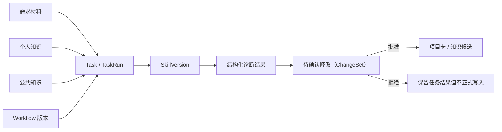

# 核心数据与状态关系

## 1. 存储原则

- **Markdown**：知识正文、来源说明、人工确认内容，是可迁移的权威资产。
- **SQLite**：空间、权限、状态、版本关系、任务运行、检查点、ChangeSet（待确认修改）、调用记录和索引。
- **可重建**：全文索引和向量索引属于派生数据，损坏后可从 Markdown 重建。
- **最小留存**：任务运行不默认保存完整对话，只保存恢复和审计所需的结构化状态。

## 2. 核心对象

| 对象 | 作用 | 关键字段 |
|---|---|---|
| `KnowledgeSpace` | 个人或公共知识空间 | `id`、`type`、`name`、`root_path`、`owner` |
| `KnowledgeItem` | 一条知识资产的元数据 | `id`、`space_id`、`markdown_path`、`status`、`source`、`version` |
| `KnowledgeRelation` | 来源、引用、派生、替代关系 | `from_id`、`to_id`、`relation_type` |
| `Task` | 用户发起的业务任务 | `id`、`title`、`status`、`goal`、`workspace_path` |
| `TaskRun` | 一次具体运行 | `id`、`task_id`、`provider`、`started_at`、`ended_at`、`usage` |
| `RunEvent` | 可回看的步骤事件 | `run_id`、`step`、`event_type`、`summary`、`created_at` |
| `Checkpoint` | 暂停与恢复所需状态 | `run_id`、`node`、`state_json`、`created_at` |
| `Skill` | 可复用能力定义 | `id`、`name`、`current_version`、`status` |
| `SkillVersion` | 不可变的具体版本 | `skill_id`、`version`、`manifest_path`、`input_schema`、`output_schema` |
| `Workflow` | 固定业务流程定义 | `id`、`name`、`version`、`definition_path`、`status` |
| `ChangeSet`（待确认修改） | 待人工确认的正式修改 | `id`、`task_id`、`target_type`、`diff`、`risk`、`status` |
| `ModelCall` | 最小模型调用记录 | `run_id`、`provider`、`model`、`usage`、`latency`、`error_type` |

## 3. 关系主链

## 4. 状态机

### 知识状态

`draft → confirmed → public_candidate → published`

异常分支：

- `public_candidate → rejected`
- `published → deprecated`

规则：个人空间允许 `draft → confirmed` 由本人完成；进入公共空间必须经过 `public_candidate`，不能直接发布。

### 任务状态

`queued → running → succeeded`

控制与异常分支：

- `running → waiting_approval → running`
- `running → paused → running`
- `running → failed`
- `queued/running/paused → cancelled`

规则：`waiting_approval` 不得自动超越；恢复时从最新有效 Checkpoint 继续。

### 待确认修改（ChangeSet）状态

`draft → pending → approved → applied`

拒绝分支：`pending → rejected`

失败分支：`approved → apply_failed`，修复后产生新版本，不覆盖旧记录。

### Skill 状态

`draft → tested → published → deprecated`

规则：运行记录绑定不可变的 `SkillVersion`，发布新版本不改变旧任务证据。

## 5. 一致性规则

1. Markdown 保存成功后，才能提交对应 SQLite 元数据事务。
2. 数据库记录必须包含 Markdown 相对路径和内容哈希。
3. 修改知识生成新版本；不得无痕覆盖已发布内容。
4. 应用待确认修改（ChangeSet）前再次校验目标版本，避免在旧版本上误写。
5. 任务中断后，只恢复可序列化状态；模型临时推理过程不作为业务证据保存。
6. 删除索引不影响 Markdown 正文；重建后检索结果应保持可解释来源。
