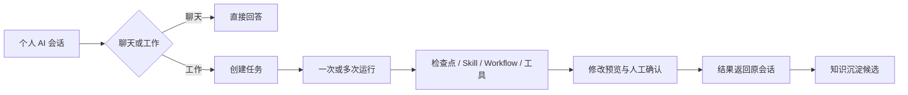

# V0.2 信息架构说明

## 1. 本轮调整结论

V0.2 从“任务优先”调整为“个人 AI 会话优先”。每位员工面对的是一个长期存在的个人 AI 智能体；聊天是默认入口，任务是工作模式中产生的持久执行对象。

旧版任务工作台不删除，改为任务看板中的任务详情和运行检查界面。

## 2. 左侧一级菜单

按固定顺序保留四个入口：

1. **新聊天**：创建个人 AI 会话；会话顶部提供“聊天 / 工作”。
2. **知识**：统一进入知识空间；页面顶部提供“个人知识 / 公共知识”。
3. **自动化**：统一进入 AI 能力工厂；页面顶部提供“Skills / Workflows”。
4. **任务看板**：统一管理持久任务；页面顶部提供“任务管理 / 运行记录”。

一级菜单下方保留“置顶”和“最近”会话，避免把个人知识、公共知识、Skill、Workflow 和运行记录拆成过多一级导航。

## 3. 个人资料与系统设置

侧栏底部只保留个人资料入口。点击后出现：

- 个人资料
- 使用情况
- 系统设置
- 退出登录

系统设置不再作为侧栏一级入口。

## 4. 聊天与工作的关系

| 模式 | 适用事项 | 系统行为 |
|---|---|---|
| 聊天 | 问答、解释、轻量写作、知识查询 | 直接回复，不强制创建任务生命周期 |
| 工作 | 多步骤分析、调用 Skill/Workflow、读写文件、持续执行 | 创建任务，记录计划、检查点、工具和审批状态 |

两种模式属于同一个个人 AI 智能体，共享用户身份和允许访问的知识，但工具权限、运行状态和正式写入规则不同。

## 5. 会话、任务和运行

- 一个会话可以产生多个任务。
- 一个任务可以因重试或恢复产生多次运行。
- 任务必须能回到来源会话。
- 普通聊天不会被伪装成任务。
- 正式写入仍必须先预览修改并经过人工确认。

## 6. 概念稿对应关系

- [智能体会话工作模式](./智能体会话工作模式-V0.2-概念稿.png)：聊天/工作切换、会话内任务进度、诊断结果和待确认修改。
- [知识空间](./知识空间-V0.2-概念稿.png)：个人/公共知识入口及 Markdown 知识正文。
- [自动化 Skill](./自动化Skill-V0.2-概念稿.png)：Skills/Workflows 入口、版本、测试和发布。
- [任务看板](./任务看板-V0.2-概念稿-v2.png)：任务管理、运行记录和返回来源会话。
- [个人资料菜单](./个人资料菜单-V0.2-状态稿.png)：个人资料、使用情况、系统设置和退出登录。

## 7. 进入代码前的确认项

1. 四个一级菜单及其顺序是否锁定。
2. “聊天 / 工作”是否作为同一会话的模式切换。
3. “工作”是否自动创建任务，还是在首次需要持续执行时再创建。
4. V0.1 是否先实现个人知识、Skills 和任务管理三个默认标签页，其他标签页只保留最小可用功能。
5. V0.2 概念稿是否作为前端设计系统提取依据。
